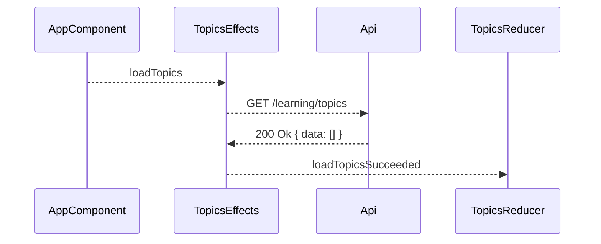
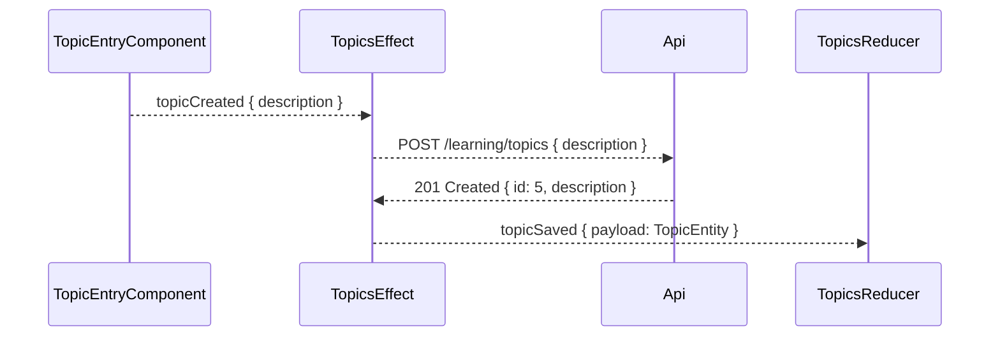

# Redux Effects

## Loading Topics

Before Refactor

```mermaid
sequenceDiagram
    AppComponent-->>TopicsEffects: loadTopics
    TopicsEffects-->>Api: GET /learning/topics
    Api-->>TopicsEffects: 200 Ok { data: [] }
    TopicsEffects-->>TopicsReducer: loadTopicsSucceeded
```

## Topic Created

```mermaid
sequenceDiagram
  TopicEntryComponent-->>TopicsEffect: topicCreated { description }
  TopicsEffect-->>Api: POST /learning/topics { description }
  Api-->>TopicsEffect: 201 Created { id: 5, description }
  TopicsEffect-->>TopicsReducer: topicSaved { payload: TopicEntity }
```
